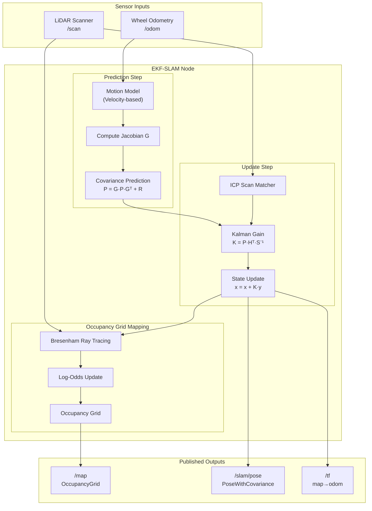

# 3. Implementation

## 3.1 Development Environment

I implemented the EKF-SLAM system in Python using Visual Studio Code on Ubuntu 22.04 LTS. I used the ROS 2 Humble framework for robot middleware, enabling real-time communication between sensor data and the SLAM algorithms. I ran inference in Gazebo simulation to keep the evaluation consistent and repeatable.

I created a dedicated ROS 2 workspace to keep dependencies isolated and to make the project easy to reproduce. I installed the required libraries for EKF computation, occupancy grid mapping, and scan matching.

## 3.2 Main Libraries and Tools

I used the following tools and libraries in the implementation:

- **rclpy** for ROS 2 Python node creation and inter-process communication.
- **NumPy** for matrix operations and Kalman filter computations.
- **SciPy** for scientific computing utilities.
- **tf2_ros** for coordinate frame transformations between map, odom, and base_link.
- **OpenCV** (optional) for visualization and debugging.

## 3.3 Project Folder Structure

I organized the project using a clear ROS 2 package structure so that SLAM components, robot description, and simulation remain separated. This structure also makes the project easier to understand and maintain.

- **robot_slam/** contains the EKF core, occupancy grid, scan matcher, and ROS 2 node.
- **robot_description/** contains the URDF robot model, meshes, and sensor configurations.
- **robot_bringup/** contains launch files for bringing up the complete system.
- **robot_sim/** contains Gazebo simulation worlds and environment models.
- **config/** contains tunable YAML parameter files for the SLAM node.

I keep the folder structure stable so that running the launch files does not require changing hard-coded paths (Figure 2).

```
EKF-SLAM/
├── src/
│   ├── robot_slam/
│   │   ├── robot_slam/
│   │   │   ├── ekf_core.py
│   │   │   ├── ekf_slam_node.py
│   │   │   ├── occupancy_grid.py
│   │   │   └── scan_matcher.py
│   │   ├── config/
│   │   │   └── ekf_slam_params.yaml
│   │   └── launch/
│   │       └── ekf_slam.launch.py
│   ├── robot_description/
│   ├── robot_bringup/
│   └── robot_sim/
├── rebuild.sh
└── readme.md
```
*Figure 2: Project folder structure used for EKF-SLAM implementation.*

## 3.4 System Architecture

The following block diagram illustrates the complete EKF-SLAM system architecture, showing the data flow from sensor inputs through the EKF prediction and update steps to the final outputs.


*Figure 3: EKF-SLAM system block diagram showing sensor inputs, processing pipeline, and outputs.*

## 3.5 ROS 2 Node Integration

I implemented a ROS 2 node that subscribes to odometry and laser scan topics, runs the EKF prediction and update, and publishes the occupancy grid map and robot pose. The node also broadcasts the map→odom transform for visualization.

**Listing 1:** ROS 2 node initialization and subscriber/publisher setup.

```python
class EKFSlamNode(Node):
    def __init__(self):
        super().__init__('ekf_slam_node')
        
        # Initialize EKF
        self.ekf = EKFCore()
        
        # Initialize occupancy grid
        self.occupancy_grid = OccGrid(
            width=map_size,
            height=map_size,
            resolution=map_resolution,
            origin_x=-map_size/2,
            origin_y=-map_size/2
        )
        
        # Initialize scan matcher
        self.scan_matcher = ScanMatcher(
            max_iterations=30,
            tolerance=1e-4,
            max_correspondence_distance=0.3
        )
        
        # Subscribers
        self.scan_sub = self.create_subscription(
            LaserScan, scan_topic, self.scan_callback, sensor_qos)
        
        self.odom_sub = self.create_subscription(
            Odometry, odom_topic, self.odom_callback, sensor_qos)
        
        # Publishers
        self.map_pub = self.create_publisher(OccupancyGrid, '/map', map_qos)
        self.pose_pub = self.create_publisher(
            PoseWithCovarianceStamped, '/slam/pose', 10)
```

### 3.5.1 Odometry callback and EKF prediction

I implemented the odometry callback to extract velocity commands and run the EKF prediction step. Listing 2 shows the core logic from `ekf_slam_node.py`.

**Listing 2:** Odometry processing and EKF prediction step.

```python
def odom_callback(self, msg: Odometry):
    current_time = Time.from_msg(msg.header.stamp)
    
    odom_x = msg.pose.pose.position.x
    odom_y = msg.pose.pose.position.y
    odom_theta = quaternion_to_yaw(msg.pose.pose.orientation)
    
    if not self.initialized:
        self.ekf.set_state([odom_x, odom_y, odom_theta])
        self.last_odom = (odom_x, odom_y, odom_theta)
        self.last_odom_time = current_time
        self.initialized = True
        return
    
    dt = (current_time.nanoseconds - self.last_odom_time.nanoseconds) / 1e9
    
    v = msg.twist.twist.linear.x
    omega = msg.twist.twist.angular.z
    
    # EKF prediction step
    self.ekf.predict(v, omega, dt)
    
    self.last_odom = (odom_x, odom_y, odom_theta)
    self.last_odom_time = current_time
```

## 3.6 EKF Core Implementation

I implemented an Extended Kalman Filter to estimate robot position and orientation. The state vector contains position (x, y) and heading (θ).

### 3.6.1 State initialization

**Listing 3:** EKF state and covariance initialization.

```python
class EKFCore:
    def __init__(self, initial_pose=None, motion_noise=None, measurement_noise=None):
        # State: [x, y, theta]
        if initial_pose is None:
            self.state = np.zeros(3)
        else:
            self.state = np.array(initial_pose, dtype=np.float64)
        
        # State covariance matrix (3x3)
        self.covariance = np.eye(3) * 0.01
        
        # Motion noise parameters (for velocity model)
        if motion_noise is None:
            self.alpha = np.array([0.1, 0.01, 0.01, 0.1])
        else:
            self.alpha = motion_noise
        
        # Measurement noise
        if measurement_noise is None:
            self.Q = np.diag([0.1, 0.1])
        else:
            self.Q = np.diag(measurement_noise)
```

### 3.6.2 Prediction step

I implemented the velocity motion model with separate handling for straight-line and arc motion. Listing 4 shows the prediction step from `ekf_core.py`.

**Listing 4:** EKF prediction step using velocity motion model.

```python
def predict(self, v: float, omega: float, dt: float):
    x, y, theta = self.state
    
    if abs(omega) < 1e-6:
        # Straight line motion
        x_new = x + v * np.cos(theta) * dt
        y_new = y + v * np.sin(theta) * dt
        theta_new = theta
        
        G = np.array([
            [1, 0, -v * np.sin(theta) * dt],
            [0, 1,  v * np.cos(theta) * dt],
            [0, 0, 1]
        ])
    else:
        # Arc motion
        r = v / omega
        x_new = x - r * np.sin(theta) + r * np.sin(theta + omega * dt)
        y_new = y + r * np.cos(theta) - r * np.cos(theta + omega * dt)
        theta_new = theta + omega * dt
        
        G = np.array([
            [1, 0, -r * np.cos(theta) + r * np.cos(theta + omega * dt)],
            [0, 1, -r * np.sin(theta) + r * np.sin(theta + omega * dt)],
            [0, 0, 1]
        ])
    
    # Motion noise covariance
    M = np.array([
        [self.alpha[0] * v**2 + self.alpha[1] * omega**2, 0],
        [0, self.alpha[2] * v**2 + self.alpha[3] * omega**2]
    ])
    
    V = np.array([
        [np.cos(theta) * dt, 0],
        [np.sin(theta) * dt, 0],
        [0, dt]
    ])
    
    R = V @ M @ V.T
    
    self.state = np.array([x_new, y_new, self.normalize_angle(theta_new)])
    self.covariance = G @ self.covariance @ G.T + R
```

### 3.6.3 Update step

I implemented the measurement update step using standard Kalman filter equations. Listing 5 shows the scan matching update from `ekf_core.py`.

**Listing 5:** EKF update step using scan matching corrections.

```python
def update_with_scan_matching(self, dx: float, dy: float, dtheta: float,
                               match_covariance: Optional[np.ndarray] = None):
    if match_covariance is None:
        match_covariance = np.diag([0.02, 0.02, 0.01])
    
    correction = np.array([dx, dy, dtheta])
    
    # Weighted average based on covariances
    K = self.covariance @ np.linalg.inv(self.covariance + match_covariance)
    
    self.state = self.state + K @ correction
    self.state[2] = self.normalize_angle(self.state[2])
    self.covariance = (np.eye(3) - K) @ self.covariance
```

## 3.7 Scan Matching Implementation

I implemented an ICP-based scan matcher to correct odometry drift by matching consecutive laser scans. The matcher converts scans to point clouds and iteratively estimates the rigid transformation.

### 3.7.1 Point cloud conversion

**Listing 6:** Converting laser scan ranges to 2D point cloud.

```python
def scan_to_points(self, ranges: np.ndarray, angle_min: float, 
                   angle_increment: float, range_min: float = 0.1,
                   range_max: float = 12.0) -> np.ndarray:
    points = []
    for i, r in enumerate(ranges):
        if np.isnan(r) or np.isinf(r) or r < range_min or r > range_max:
            continue
        
        angle = angle_min + i * angle_increment
        x = r * np.cos(angle)
        y = r * np.sin(angle)
        points.append([x, y])
    
    return np.array(points) if points else np.empty((0, 2))
```

### 3.7.2 ICP matching algorithm

**Listing 7:** ICP iteration loop for scan-to-scan matching.

```python
def match(self, current_ranges, angle_min, angle_increment, ...):
    current_points = self.scan_to_points(current_ranges, angle_min, 
                                          angle_increment, range_min, range_max)
    
    if self.prev_points is None or len(self.prev_points) < 10:
        self.prev_points = current_points
        return 0.0, 0.0, 0.0, 0.0, False
    
    # Downsample for efficiency
    step = max(1, len(current_points) // 200)
    source = current_points[::step]
    target = self.prev_points[::step]
    
    dx, dy, dtheta = initial_guess
    
    for iteration in range(self.max_iterations):
        transformed = self.transform_points(source, dx, dy, dtheta)
        
        src_matched, tgt_matched, dists = self.find_correspondences(
            transformed, target)
        
        if len(src_matched) < 10:
            break
        
        source_original = self.transform_points(src_matched, -dx, -dy, -dtheta)
        ddx, ddy, ddtheta = self.estimate_transform(source_original, tgt_matched)
        
        dx, dy, dtheta = dx + ddx, dy + ddy, dtheta + ddtheta
        
        if delta < self.tolerance:
            break
    
    fitness = np.mean(dists) if len(dists) > 0 else float('inf')
    success = fitness < 0.2 and len(dists) > len(source) * 0.3
    
    self.prev_points = current_points
    return -dx, -dy, -dtheta, fitness, success
```

### 3.7.3 Transform estimation using SVD

**Listing 8:** Rigid transform estimation using singular value decomposition.

```python
def estimate_transform(self, source: np.ndarray, target: np.ndarray):
    centroid_source = np.mean(source, axis=0)
    centroid_target = np.mean(target, axis=0)
    
    source_centered = source - centroid_source
    target_centered = target - centroid_target
    
    # Cross-covariance matrix
    H = source_centered.T @ target_centered
    
    # SVD decomposition
    U, S, Vt = np.linalg.svd(H)
    R = Vt.T @ U.T
    
    # Handle reflection case
    if np.linalg.det(R) < 0:
        Vt[-1, :] *= -1
        R = Vt.T @ U.T
    
    dtheta = np.arctan2(R[1, 0], R[0, 0])
    t = centroid_target - R @ centroid_source
    
    return t[0], t[1], dtheta
```

## 3.8 Occupancy Grid Mapping

I implemented a log-odds occupancy grid that updates cell probabilities using laser scan observations. The grid uses Bresenham's line algorithm for efficient ray tracing.

### 3.8.1 Grid initialization

**Listing 9:** Occupancy grid initialization with log-odds representation.

```python
class OccupancyGrid:
    def __init__(self, width=20.0, height=20.0, resolution=0.05,
                 origin_x=-10.0, origin_y=-10.0):
        self.resolution = resolution
        self.origin_x = origin_x
        self.origin_y = origin_y
        
        self.grid_width = int(width / resolution)
        self.grid_height = int(height / resolution)
        
        # Log-odds grid (0 = unknown)
        self.log_odds = np.zeros((self.grid_height, self.grid_width), dtype=np.float32)
        
        # Log-odds update values
        self.l_occ = 0.85
        self.l_free = -0.4
        self.l_min = -5.0
        self.l_max = 5.0
```

### 3.8.2 Scan integration with ray tracing

**Listing 10:** Updating occupancy grid using laser scan and Bresenham's algorithm.

```python
def update_with_scan(self, robot_x, robot_y, robot_theta,
                      ranges, angle_min, angle_increment,
                      range_min=0.1, range_max=12.0):
    robot_gx, robot_gy = self.world_to_grid(robot_x, robot_y)
    
    for i, r in enumerate(ranges):
        if np.isnan(r) or np.isinf(r) or r < range_min or r > range_max:
            continue
        
        beam_angle = robot_theta + angle_min + i * angle_increment
        
        end_x = robot_x + r * np.cos(beam_angle)
        end_y = robot_y + r * np.sin(beam_angle)
        end_gx, end_gy = self.world_to_grid(end_x, end_y)
        
        # Bresenham line tracing
        cells = self.bresenham_line(robot_gx, robot_gy, end_gx, end_gy)
        
        # Mark cells along ray as free
        for j, (gx, gy) in enumerate(cells[:-1]):
            self.update_cell(gx, gy, occupied=False)
        
        # Mark endpoint as occupied
        if cells and r < range_max - 0.1:
            last_gx, last_gy = cells[-1]
            self.update_cell(last_gx, last_gy, occupied=True)
```

## 3.9 Output Publishing and Visualization

For each SLAM cycle, the system publishes:

- An occupancy grid map on `/map` at 1 Hz.
- Robot pose with covariance on `/slam/pose` at 10 Hz.
- The map→odom transform on `/tf` synchronized with odometry.

**Listing 11:** Publishing occupancy grid as ROS 2 message.

```python
def publish_map(self):
    if not self.initialized:
        return
    
    msg = OccupancyGrid()
    msg.header.stamp = self.get_clock().now().to_msg()
    msg.header.frame_id = self.map_frame
    
    msg.info.resolution = self.occupancy_grid.resolution
    msg.info.width = self.occupancy_grid.grid_width
    msg.info.height = self.occupancy_grid.grid_height
    msg.info.origin.position.x = self.occupancy_grid.origin_x
    msg.info.origin.position.y = self.occupancy_grid.origin_y
    
    msg.data = self.occupancy_grid.get_occupancy_grid_msg_data().tolist()
    
    self.map_pub.publish(msg)
```

## 3.10 Reproducible Execution Procedure

I designed the launch files so that I can run the SLAM system with configurable parameters. This approach reduces manual edits and supports running different configurations quickly.

**Build and run commands:**

```bash
# Build workspace
cd EKF-SLAM
colcon build --symlink-install
source install/setup.bash

# Launch simulation with SLAM
ros2 launch robot_bringup robot_sim_bringup.launch.py

# Launch EKF-SLAM node (separate terminal)
ros2 launch robot_slam ekf_slam.launch.py use_sim_time:=true

# Visualize in RViz2
rviz2
```

**Verification commands:**

```bash
# Check node is running
ros2 node list | grep ekf_slam

# View published topics
ros2 topic list | grep -E "(map|slam)"

# Echo pose output
ros2 topic echo /slam/pose
```
